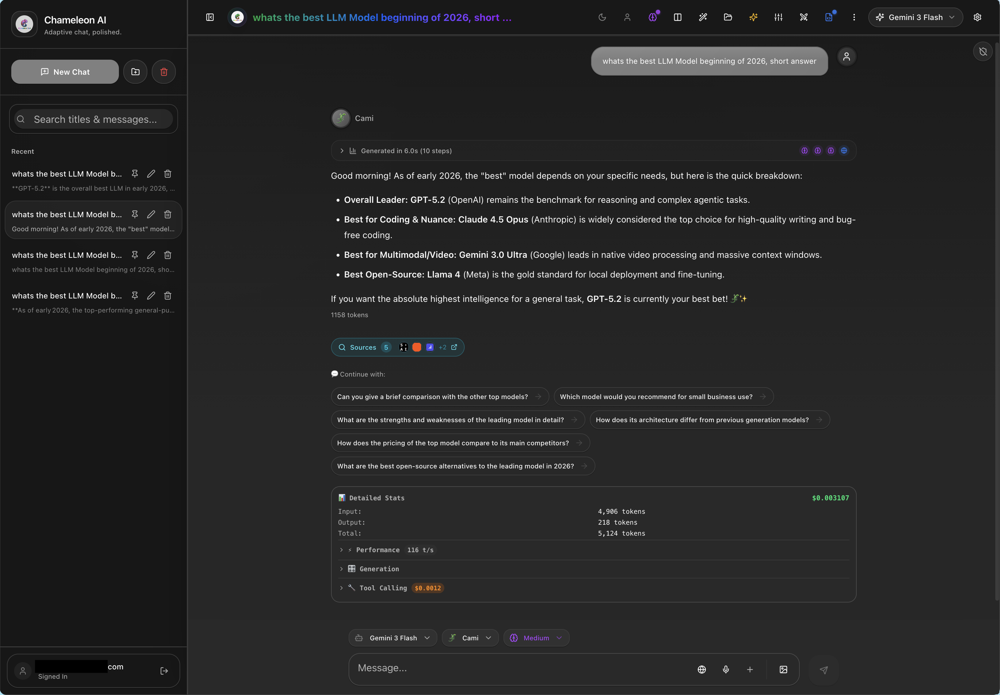

# Chameleon AI Chat

An open-source AI chat application with real-time cost tracking, 31 conversational personas, and training data export.


<!--
TODO: Add a screenshot here before public release

-->

## Features

### Core
- **Real-time cost tracking** - Actual billing data per message from OpenRouter, not estimates
- **31 AI personas** - From Cami (adaptive chameleon) to Dev (programmer) to Mythos (worldbuilder)
- **100+ AI models** - Claude Opus 4.5, GPT-5, Gemini 3, Grok 4, Llama 4, DeepSeek, and more via OpenRouter
- **Two modes** - Simple Mode for casual users, Advanced Mode for power users with full controls
- **Training data export** - Export conversations as JSONL for fine-tuning your own models

### AI Experience
- **Smart follow-ups** - AI-generated contextual suggestions after each response (quick, deep dive, related topics)
- **Live streaming** - Watch responses generate in real-time with token-by-token streaming
- **Streaming history** - Review past streaming sessions with performance metrics and reasoning traces
- **Semantic memory** - AI remembers context across conversations using RAG with pgvector

### Privacy & Security
- **Private chat mode** - Ephemeral conversations that leave no trace
- **Self-hostable** - Run your own instance with full control
- **Your API keys** - Keys stored locally in your browser, never on servers

### Integrations
- **Web search** - Integrated search via Tavily, Serper, or Exa
- **Voice input/output** - Whisper transcription and text-to-speech
- **Image analysis** - Vision-capable models for image understanding

### Mobile & Cross-Platform
- **PWA support** - Install as app on any device, works offline
- **Mobile-first layouts** - Optimized responsive UI for phones and tablets
- **Android APK** - Native Android app via Capacitor with push notifications

## Quick Start

```bash
git clone https://github.com/robbyczgw-cla/Chameleon-AI-Chat.git
cd Chameleon-AI-Chat
npm install
cp .env.example .env.local
# Add your API keys to .env.local
npm run dev
```

Open [http://localhost:3000](http://localhost:3000)

### Requirements

- Node.js 18+
- [OpenRouter API key](https://openrouter.ai) (required)
- [Supabase account](https://supabase.com) (required for auth/sync)

### Optional

- Tavily/Serper/Exa API key for web search
- OpenAI API key for Whisper voice transcription

## Documentation

| Guide | Description |
|-------|-------------|
| [User Guide](./docs/user-guide.md) | Complete walkthrough |
| [Personas](./docs/personas.md) | All 31 personas explained |
| [Memory System](./docs/MEMORY_SYSTEM.md) | How semantic memory works |
| [Architecture](./docs/ARCHITECTURE.md) | Technical deep dive |
| [Deployment](./docs/deployment.md) | Self-hosting guide |
| [Android Build](./docs/CAPACITOR_ANDROID.md) | Building the Android app |

## Tech Stack

- **Frontend**: Next.js 16, React 19, TypeScript 5, Tailwind CSS
- **UI**: shadcn/ui components, Radix primitives
- **Database**: Supabase (PostgreSQL + pgvector for embeddings)
- **AI**: OpenRouter API (100+ models)
- **Mobile**: Capacitor 8 (Android), PWA (iOS/Desktop)
- **Auth**: Supabase Auth with Row-Level Security

## Privacy

- **Private Chat Mode**: Conversations not saved anywhere
- **Self-hostable**: Run your own instance
- **Your API keys**: Keys stored locally, never on our servers
- **Row-level security**: Supabase RLS ensures data isolation

See [SECURITY.md](./SECURITY.md) for details.

## Contributing

See [CONTRIBUTING.md](./CONTRIBUTING.md) for guidelines.

Quick links:
- [Report a bug](https://github.com/robbyczgw-cla/Chameleon-AI-Chat/issues/new?template=bug_report.md)
- [Request a feature](https://github.com/robbyczgw-cla/Chameleon-AI-Chat/issues/new?template=feature_request.md)
- [Discussions](https://github.com/robbyczgw-cla/Chameleon-AI-Chat/discussions)

## License

MIT License - see [LICENSE](./LICENSE)

## Acknowledgments

- [OpenRouter](https://openrouter.ai) - Unified API for 100+ AI models
- [Supabase](https://supabase.com) - Database, auth, and vector search
- [shadcn/ui](https://ui.shadcn.com) - Beautiful UI components
- [Radix UI](https://radix-ui.com) - Accessible component primitives
- [Tailwind CSS](https://tailwindcss.com) - Utility-first styling
- [Capacitor](https://capacitorjs.com) - Native mobile runtime
- [Vercel](https://vercel.com) - Hosting and deployment
- [Lucide](https://lucide.dev) - Icon library
